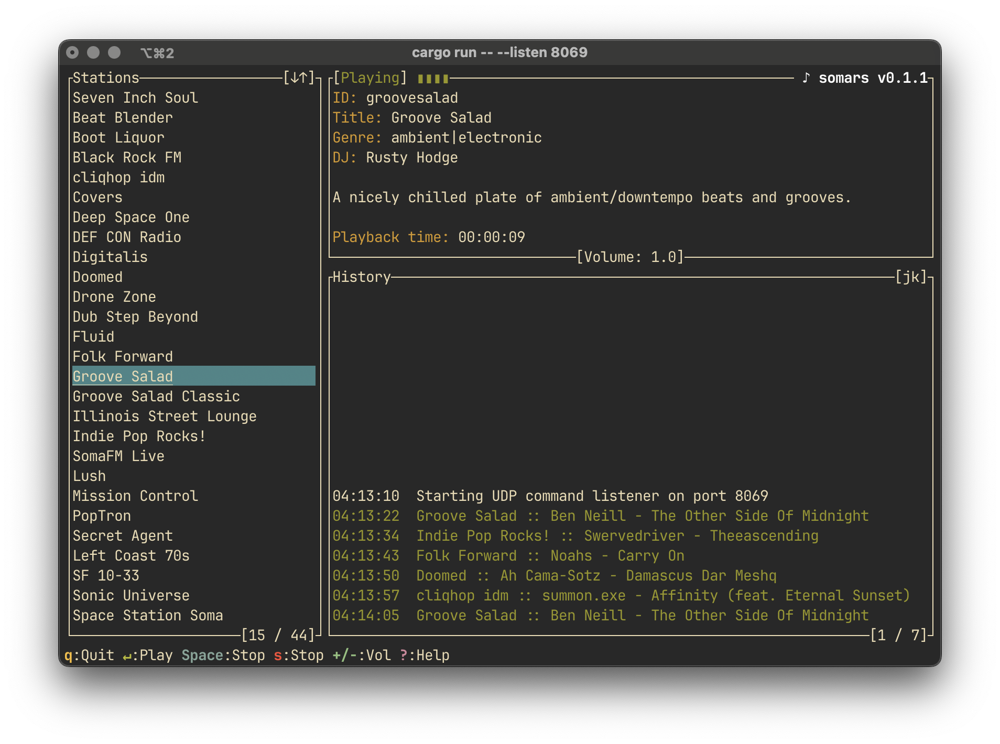

# somars - A Terminal-Based SomaFM Player



A Rust implementation of a SomaFM internet radio player with TUI interface and UDP control.

## Features
- Terminal User Interface (TUI) with station browser
- MP3 stream playback
- Volume control
- Playback history tracking
- UDP remote control interface
- Cross-platform support (Linux/macOS/Windows)

## Installation

```bash
cargo install --path .
```

**Note:** Requires `pkg-config` and `libasound2-dev` (Linux) for audio support:
```bash
sudo apt-get install pkg-config libasound2-dev
```

**Note:** The default UDP port is 8069. When using `--listen`, ensure the port is available. 
Use `--port` to specify a different port for both listening and broadcasting.

## Usage

```bash
somars [OPTIONS]
```

### Command Line Options:
- `--log-level <1|2>` - Log verbosity (1=minimal, 2=verbose)
- `--station <ID>` - Auto-play station on startup (e.g., `groovesalad`)
- `--listen` - Enable UDP control listener
- `--port <NUM>` - Set UDP port for both listening and broadcasting [default: 8069]
- `--broadcast <MSG>` - Send UDP command to network and exit

## UDP Command Interface

### Supported Commands:
```
play        - Start/resume playback
pause       - Pause playback
stop        - Stop playback
volume up    - Increase volume by 10%
volume down  - Decrease volume by 10%
volume <N>   - Set volume (0.0-2.0)
tune <ID>   - Switch to station by ID
```

### Example: Control via netcat
```bash
# Send play command (default port 8069)
echo "play" | nc -u -w0 localhost 8069

# Send to custom port
echo "volume 0.5" | nc -u -w0 localhost 9070
```

### Example: Broadcast command
```bash
# Broadcast stop command to all instances on default port
somars --broadcast "stop"

# Broadcast to custom port
somars --port 9070 --broadcast "tune groovesalad"

# Using socat with broadcast
echo "tune groovesalad" | socat -u - udp-datagram:255.255.255.255:8069,reuseport,broadcast
```

## Key Controls
- `↑/↓` - Navigate stations
- `Enter` - Play selected station
- `Space` - Toggle pause/play
- `+/-` - Adjust volume
- `?` - Toggle help screen
- `q` - Quit

## License
MIT License

---

**Note:** This project is not affiliated with SomaFM. Please support SomaFM at [somafm.com](https://somafm.com).
